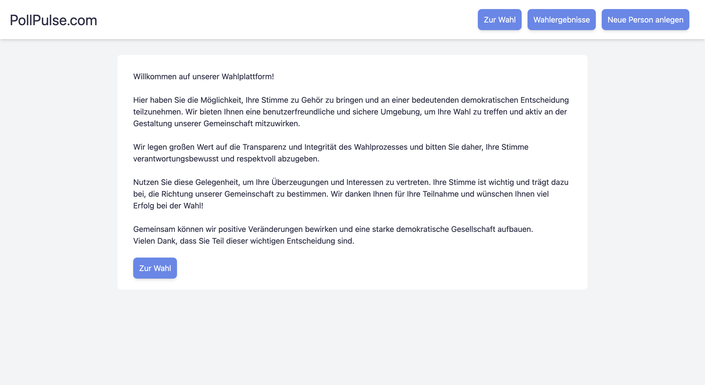

## Voting system in Laravel

This project shows a simple voting system in Laravel using a Python API for backend services.

### Quickstart

#### `npm install`
To install packages, that the project depends on.

#### `composer install`
To read the composer.json file from the current directory, resolves the dependencies, and installs them into vendor.

#### `npm run dev`
To start the Next.js development server.

#### `uvicorn api:api --reload`
To start the api.py.

#### `php artisan serve`
To run the server on [http://127.0.0.1:8000].

